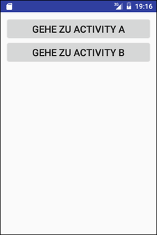
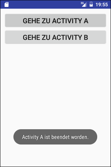
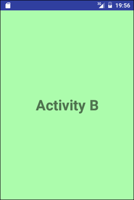

# Android-App "Drei Activities"

App demonstrates how to determine which of two activities started by the *MainActivity* was finished.

 

Identifiers (names for classes, variables and methods), UI text and (JavaDoc) comments are in German only.

 

----
## Screenshots

  

 

  

 

  

 

----
# License

See the [LICENSE file](LICENSE.md) for license rights and limitations (BSD 3-Clause License).
